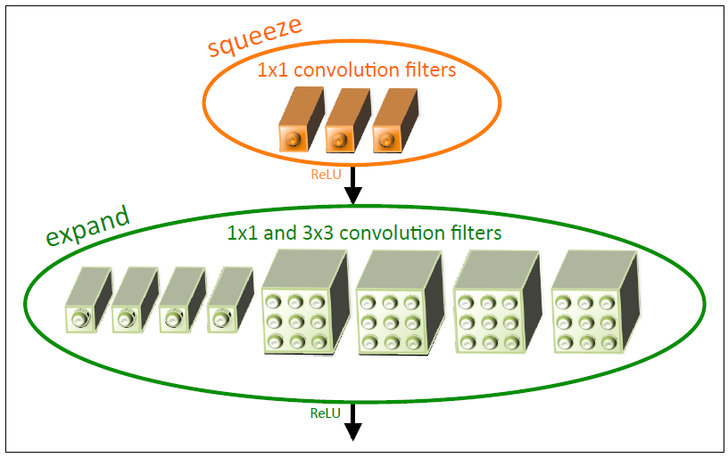
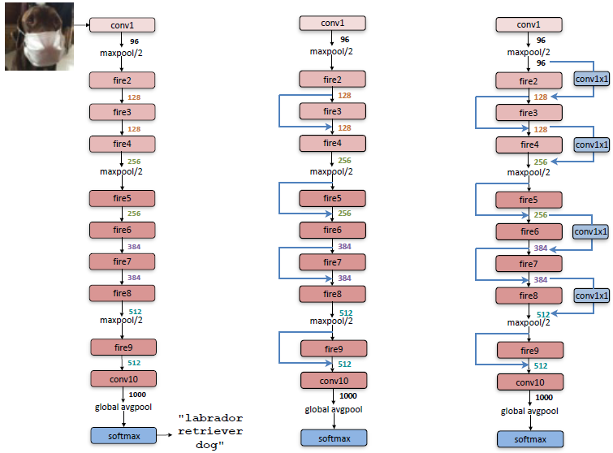
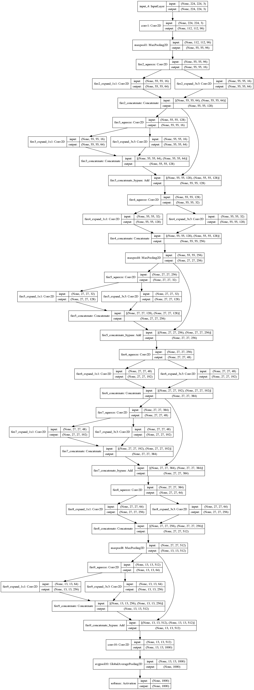
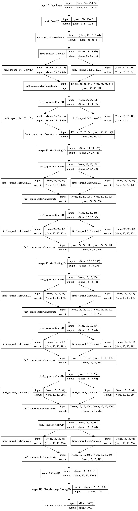

# SqueezeNet
SqueezeNet is a small CNN architecture which has fewer parameters than other CNN's. Nevertheless it achieves the same results (accuracy) as architectures like AlexNet.

This small architecture of SqueezeNet offers several advantages [1]:
- less communication across servers during distributed training
- lightweight model that needs less bandwith to transfer e.g. from cloud to car
- feasible to deploy on hardware with limited memory

SqueezeNet has several building blocks named fire modules. This fire module contains a `squeeze` convolution layer (which has only 1x1 filters), feeding into an `expand` layer that has a mix of 1x1 and 3x3 convolution filters.

In the following image you can see the composition of fire module:<br>


SqueezeNet is divided into three types (SqueezeNet, SqueezeNet with simple bypass, SqueezeNet with complex bypass - from left):<br>
<kbd></kbd>

I just implemented SqueezeNet and SqueezeNet with simple bypass. The authors reported best accuracy by using simple bypass. Important to mention, SqueezeNet with simple bypass does not increase parameters!

Additionally the author of SqueezeNet published a newer version 1.1 which has again fewer parameters and takes less time to train. I implemented both versions and added `compression` method to the architecture as optional parameter to reduce the parameters too.

## Usage
```
from squeezenet import SqueezeNet, SqueezeNet_11

# Version 1.0
model = SqueezeNet(input_shape=(224,224,3), nb_classes=1000, use_bypass=True)
model.summary()

# Version 1.1
model_11 = SqueezeNet_11(input_shape=(224,224,3), nb_classes=1000)
model_11.summary()
```
Version 1.0:<br><kbd></kbd>

Version 1.1:<br><kbd></kbd>

## References
[1] [SqueezeNet](https://arxiv.org/abs/1602.07360)<br>
[2] [Original implementation of SqueezeNet](https://github.com/DeepScale/SqueezeNet)

## Author
Christopher Masch